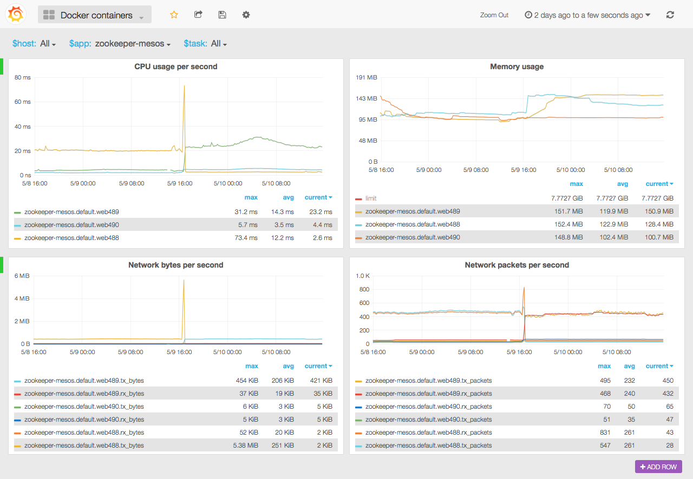

# Collect docker container resource usage

This is collectd plugin and docker image to collect resource usage
from docker containers. Resource usage collected from `docker stats` API
and sent to graphite installation.

This plugin treats containers as tasks that run as parts of apps.
To set an application name, you should set label `collectd_docker_app`
or env variable `COLLECTD_DOCKER_APP` to the application name.
To set a task name,you should set label `collectd_docker_task`
or env variable `COLLECTD_DOCKER_TASK` to the task name. Task name
is optional and only useful when you can run several instances of
the same application on the same host. With task name you could
see metrics of individual containers.

Containers can be added and removed on the fly, no need to restart collectd.

## Reported metrics

Metric names look line this:

```
collectd.<host>.docker_stats.<app>.<task>.<type>.<metric>
```

Gauges:


* CPU
    * `cpu.user`
    * `cpu.system`
    * `cpu.total`

* Memory overview
    * `memory.limit`
    * `memory.max`
	* `memory.usage`

* Memory breakdown
	* `memory.active_anon`
    * `memory.active_file`
    * `memory.cache`
    * `memory.inactive_anon`
    * `memory.inactive_file`
    * `memory.mapped_file`
    * `memory.pg_fault`
    * `memory.pg_in`
    * `memory.pg_out`
    * `memory.rss`
    * `memory.rss_huge`
    * `memory.unevictable`
    * `memory.writeback`

* Network (bridge mode only)
    * `net.rx_bytes`
    * `net.rx_dropped`
    * `net.rx_errors`
    * `net.rx_packets`
    * `net.tx_bytes`
    * `net.tx_dropped`
    * `net.tx_errors`
    * `net.tx_packets`

## Grafana dashboard

Grafana 2 [dashboard](grafana2.json) is included.



#### Graphite metrics extracted from the dashboard

* CPU usage per second

```
aliasByNode(scaleToSeconds(nonNegativeDerivative(collectd.$host.docker_stats.$app.$task.gauge.cpu.total), 1), 3, 4, 1)
```

* Memory limit

```
alias(averageSeries(collectd.$host.docker_stats.$app.$task.gauge.memory.limit), 'limit')
```

* Memory usage

```
aliasByNode(collectd.$host.docker_stats.$app.$task.gauge.memory.usage, 3, 4, 1)
```

* Network bytes per second tx

```
aliasByNode(scaleToSeconds(nonNegativeDerivative(collectd.$host.docker_stats.$app.$task.gauge.net.tx_bytes), 1), 3, 4, 1, 7)
```

* Network bytes per second rx

```
aliasByNode(scaleToSeconds(nonNegativeDerivative(collectd.$host.docker_stats.$app.$task.gauge.net.rx_bytes), 1), 3, 4, 1, 7)
```

* Network packets per second tx

```
aliasByNode(scaleToSeconds(nonNegativeDerivative(collectd.$host.docker_stats.$app.$task.gauge.net.tx_packets), 1), 3, 4, 1, 7)
```

* Network packets per second rx

```
aliasByNode(scaleToSeconds(nonNegativeDerivative(collectd.$host.docker_stats.$app.$task.gauge.net.rx_packets), 1), 3, 4, 1, 7)
```

## Running

Minimal command:

```
docker run -d -v /var/run/docker.sock:/var/run/docker.sock \
    -e GRAPHITE_HOST=<graphite host> -e COLLECTD_HOST=<colllectd host> \
    -e COLLECTD_DOCKER_APP=<app name> bobrik/collectd-docker
```

### Environment variables

* `COLLECTD_DOCKER_APP` - graphite-friendly application name.
* `COLLECTD_DOCKER_TASK` - graphite-friendly task name, defaults to `default`.
* `COLLECTD_HOST` - host to use in metric name.
* `COLLECTD_INTERVAL` - metric update interval in seconds, defaults to `10`.
* `GRAPHITE_HOST` - host where carbon is listening for data.
* `GRAPHITE_PORT` - port where carbon is listening for data, `2003` by default.
* `GRAPHITE_PREFIX` - prefix for metrics in graphite, `collectd.` by default.

Note that this docker image is very minimal and libc inside does not
support `search` directive in `/etc/resolv.conf`. You have to supply
full hostname in `GRAPHITE_HOST` that can be resolved with nameserver.

## License

MIT
